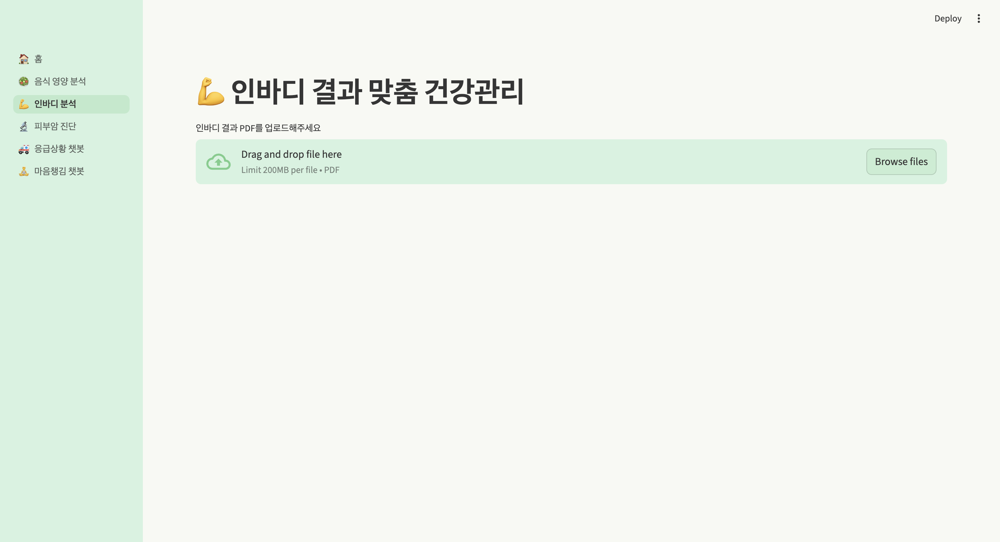

# 🏥 AI 건강 도움 서비스

**AI·ML, Streamlit, OpenAI, gTTS 기반의 개인 맞춤 건강관리 웹앱**

---

## 📋 프로젝트 개요
앱 전체 Home 화면 예시  

AI 기술을 심플한 UI와 통합하여 개인 건강관리와 의료 정보 접근성을 높인 종합 서비스입니다.  
- **Streamlit** 프레임워크로 개발된 직관적 웹 환경
- *응급상황 대처/자가진단 챗봇* 및 *정신건강/마음챙김 챗봇* 등 다양한 AI 챗봇 서비스  
- OpenAI LLM과 gTTS(TTS)로 시각·청각 정보를 동시에 제공  
- 의료 상담 대체 X, 정보·가이드 제공 목적

---

## 🎯 주요 기능
### 🍽️ 음식 영양 분석
- **음식 영양 분석:** 사진 업로드, 영양성분 안내, 개인 건강 조언  
- 영양 분석 메인 화면  
  
- 분석 결과 화면  
  
  

### 💪 인바디 결과 분석
- **인바디 결과 분석:** PDF 업로드, 체성분 분석, 맞춤 운동·식단 추천 
- 인바디 메인 화면  
  
- 인바디 결과 예시  
  

### 🩺 피부암 진단 보조
- **피부암 진단 보조:** 이미지 업로드, AI 판단·상담 
- 진단 메인 화면  
  
- 피부 사진 업로드 및 AI 분석  
  
  

### 🚑 응급 상황 챗봇
- **응급 상황 챗봇:** 실시간 증상 입력, 행동 지침/병원 안내 
- 응급 챗봇 메인 화면  
  
- 챗봇 대화 예시  
  

### 🧠 정신건강/마음챙김 챗봇
- **정신건강/마음챙김 챗봇:** 고민·스트레스 대화, 위로 메시지, TTS 음성 변환
- 정신건강 챗봇 메인 화면  
  
- 대화·TTS 결과 예시  
  

---

## 🛠️ 기술 스택

- **Python, Streamlit**
- **OpenAI API (GPT-3.5/4/4o)**
- **gTTS (Google Text-to-Speech)**
- **Pillow, pandas, numpy, PyPDF2**
- **Git & GitHub 관리**
- **.streamlit/secrets.toml 안전 관리**

---

## 💡 사용 방법

1. `requirements.txt` 기반으로 패키지 설치  
2. `.streamlit/secrets.toml`에 OpenAI API 키 입력  
3. Streamlit 앱 실행  
4. 브라우저에서 다양한 챗봇·분석 기능 직접 사용!
5. TTS(음성 안내)는 gTTS 기반, ffmpeg 설치 필요:

---

## 🚨 주의 사항

- 모든 의료 조언/진단은 정보와 가이드일 뿐, 반드시 전문가 상담/치료를 병행할 것
- **API키, secrets.toml 등은 절대 깃허브에 업로드 금지! (.gitignore 설정 필수)**
- TTS·AI 결과는 완전 자동 생성이므로 검증/주의 필요

---

## 👨‍💻 개발자 소개

### SMU 소프트웨어학과
- 금한준 (개발총괄, 기획)
- 박세호 (모델개발, 리서치)
- 오형민 (모델개발, 리서치)
- 오현기 (데이터 전처리, 기획)

---
